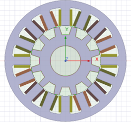
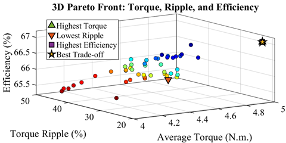
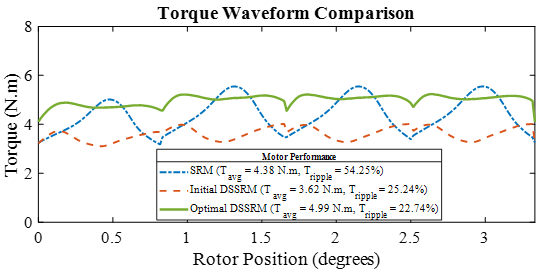

# Design Optimization of a Double-Stator Switched Reluctance Motor using the NSGA-II Algorithm

> A multi-objective optimization of a Double-Stator Switched Reluctance Motor (DSSRM) using the NSGA-II algorithm. This study aims to overcome the traditional limitations of Switched Reluctance Motors (SRMs), such as high torque ripple and low torque density, by developing a design that is superior in both performance and efficiency.

## Table of Contents

- [The Challenge](#the-challenge)
- [The Solution: Double-Stator SRM](#the-solution-double-stator-srm)
- [Methodology](#methodology)
  - [Optimization Objectives](#optimization-objectives)
  - [Decision Variables](#decision-variables)
  - [Algorithm](#algorithm)
- [Results](#results)
  - [The Pareto Front](#the-pareto-front)
  - [Selecting the Optimal Design](#selecting-the-optimal-design)
  - [Performance Comparison](#performance-comparison)
- [Prerequisites](#Prerequisites)
- [Contact](#contact)

## The Challenge

Switched Reluctance Motors (SRMs) are known for their robust, magnet-free construction. However, their broader use is limited by two significant disadvantages:
1.  **High Torque Ripple**: The discrete, non-linear torque production mechanism in SRMs results in significant torque pulsations, which can cause vibrations and acoustic noise.
2.  **Low Torque Density**: Compared to permanent magnet motors, SRMs often produce less torque for their size and weight, making them less ideal for space-constrained applications.

  
   
  <em>Fig 1. The radial-flux SRM configuration.</em>

## The Solution: Double-Stator SRM

To address these issues, this project investigates an innovative **Double-Stator SRM (DSSRM)** topology. This design features an inner and outer stator with a shared rotor in between. By carefully controlling the two stators, the torque pulsations can be designed to counteract each other, leading to a significant reduction in overall torque ripple.

While the DSSRM structure effectively improves torque quality, achieving high average torque density is a complex design challenge requiring formal optimization.

## Methodology

The design process involves navigating a complex web of conflicting objectives. For instance, increasing torque often increases manufacturing cost, while modifications to reduce ripple might compromise efficiency. This necessitates a multi-objective optimization approach.

### Optimization Objectives

The optimization seeks to resolve the trade-offs between four conflicting performance metrics:

- **Maximize**: Average Torque ($T_{avg}$)
- **Maximize**: Efficiency ($\eta$)
- **Minimize**: Torque Ripple ($T_{ripple}$)
- **Minimize**: Manufacturing Cost

### Decision Variables

The NSGA-II algorithm systematically adjusts seven key geometric and winding parameters to find the optimal design:

1.  Outer Stator Tooth Width
2.  Inner Stator Tooth Width
3.  Outer Stator Yoke Thickness
4.  Inner Stator Yoke Thickness
5.  Rotor Tooth Width
6.  Number of Winding Turns in the Outer Stator
7.  Number of Winding Turns in the Inner Stator

### Algorithm

The **Non-dominated Sorting Genetic Algorithm II (NSGA-II)** was used to solve this multi-objective problem. NSGA-II is a powerful evolutionary algorithm known for its ability to find a diverse set of high-quality, non-dominated solutions (the Pareto front). It uses two core mechanisms:
- **Non-Dominated Sorting**: To rank solutions into layers (fronts) based on Pareto dominance.
- **Crowding Distance**: To maintain a well-distributed set of solutions along each front, ensuring a diverse range of trade-offs.

## Results

### The Pareto Front

The optimization process successfully generated a Pareto front consisting of 50 unique, optimal DSSRM designs. Each point on this front represents the best possible trade-off, where no single objective can be improved without degrading at least one other objective. The 3-D Pareto front below visualizes the achievable trade-offs between the three key performance metrics.

  
   
  <em>Fig 2. The 3-D Pareto front showing the trade-offs between Average Torque, Torque Ripple, and Efficiency.</em>

### Selecting the Optimal Design

For this project, **maximum average torque** was the highest priority. A key finding was that the design with the highest torque also offered the **highest efficiency**. This "win-win" scenario made the choice clear. While this point did not have the absolute lowest ripple, it was an acceptable compromise for maximizing the two most critical objectives. This final design is marked as the "Best Trade-off".

### Performance Comparison

The final optimized DSSRM demonstrates vast improvements over both a classical SRM and an unoptimized, initial DSSRM design. The torque waveform comparison clearly shows that the optimal design has both a significantly higher average torque and lower torque ripple.

  
   
  <em>Fig 3. Torque waveforms comparing the classical SRM, initial DSSRM, and the final optimized DSSRM.</em>

The final performance metrics are as follows:
- **Optimal DSSRM**: $T_{avg}$ = 4.99 N.m, $T_{ripple}$ = 22.74%
- **Initial DSSRM**: $T_{avg}$ = 3.62 N.m, $T_{ripple}$ = 25.24%
- **Classical SRM**: $T_{avg}$ = 4.38 N.m, $T_{ripple}$ = 54.25%

This study successfully shows that combining the DSSRM topology with the NSGA-II algorithm is an effective strategy for developing high-performance SRMs.

## Prerequisites

* Necessary software or libraries: MATLAB, ANSYS Electronics Desktop (Maxwell).

## Contact

Tohid Sharifi - hamidsharifi32@gmail.com
